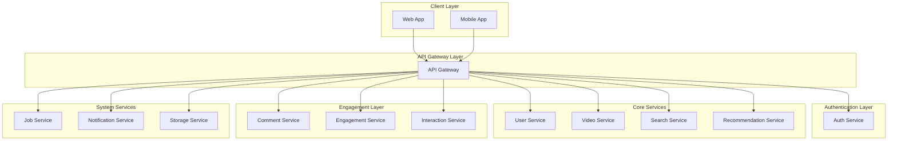

# Netflix Server - Microservices Architecture

<div align="center">


_A scalable Netflix-inspired streaming platform built with microservices architecture_

</div>

---

## 🏗️ Architecture Overview

This project implements a complete Netflix-like streaming service using **microservices architecture** with Docker containerization. Each service is independently deployable, scalable, and maintainable.



## Services Architecture

### **Authentication & Authorization**

- **`auth-service`** - JWT-based authentication, Decentralization

### **API Management**

- **`api-gateway`** - Request routing, load balancing, rate limiting, API versioning

### **User Management**

- **`user-service`** - User profiles, preferences, subscription management

### **Content Management**

- **`video-service`** - Video metadata, content catalog
- **`storage-service`** - File storage with minIO, video processing

### **Discovery & Intelligence**

- **`search-service`** - Elasticsearch-powered search, filtering, content discovery
- **`recommendation-service`** - Algorithms-based recommendations, collaborative filtering

### **Social Features**

- **`comment-service`** - User reviews, ratings, comments system
- **`engagement-service`** - Watch history, favorites, watchlists
- **`interaction-service`** - Likes, shares, social interactions

### **System Services**

- **`notification-service`** - Push notifications, email alerts, in-app messaging
- **`job-service`** - Background tasks, video processing, data analytics

## Technology Stack

<div align="center">

| Category             | Technologies                        |
| -------------------- | ----------------------------------- |
| **Backend**          | Nestjs, MinIO, FFmpeg, Firebase,... |
| **Databases**        | PostgreSQL, MongoDB, Redis          |
| **Message Queue**    | RabbitMQ, Redis                     |
| **Search Engine**    | Elasticsearch, Kibana               |
| **Containerization** | Docker, Docker Compose              |
| **API Gateway**      | Kong, Nginx                         |
| **Authentication**   | JWT, OAuth 2.0                      |

</div>

## Quick Start

### Prerequisites

- Docker & Docker Compose
- Node.js 18+
- Git

### Installation

1. **Clone the repository**

   ```bash
   git clone https://github.com/your-username/netflix-server.git
   cd netflix-server
   ```

2. **Environment Setup**

   ```bash
   cp .env.example .env
   # Edit .env file with your configuration
   ```

3. **Start all services**

   ```bash
   docker-compose up -d
   ```

4. **Verify services**
   ```bash
   docker-compose ps
   ```

### 🔧 Development Mode

Run individual services for development:

```bash
# Start dependencies (databases, message queues)
docker-compose up -d postgres mongodb redis rabbitmq

# Run specific service
cd user-service
npm install
npm run dev
```

## Configuration

### Environment Variables

Create a `.env` file with the following variables:

```env
# Database Configuration
POSTGRES_HOST=postgres
POSTGRES_PORT=5432
POSTGRES_DB=netflix_db
POSTGRES_USER=netflix_user
POSTGRES_PASSWORD=your_password

MONGO_URI=mongodb://mongodb:27017/netflix

REDIS_HOST=redis
REDIS_PORT=6379

# JWT Configuration
JWT_SECRET=your_super_secret_key
JWT_EXPIRES_IN=7d

# API Gateway
API_GATEWAY_PORT=8080

# External Services
AWS_ACCESS_KEY_ID=your_aws_key
AWS_SECRET_ACCESS_KEY=your_aws_secret
S3_BUCKET_NAME=netflix-videos

# Email Service
SMTP_HOST=smtp.gmail.com
SMTP_PORT=587
SMTP_USER=your_email@gmail.com
SMTP_PASS=your_password
```

## Docker Services 🐳

The `docker-compose.yml` includes:

- **Application Services**: All microservices
- **Storage and Stream**: MinIO, FFmpeg
- **Databases**: PostgreSQL, MongoDB, Redis
- **Message Queue**: RabbitMQ, Redis
- **Search Engine**: Elasticsearch
- **Monitoring**: Prometheus, Grafana
- **Load Balancer**: Nginx

## API Documentation

### Authentication Endpoints

```
POST /auth/register     - User registration
POST /auth/login        - User login
POST /auth/refresh      - Refresh JWT token
POST /auth/logout       - User logout
```

### User Endpoints

```
GET    /users/profile   - Get user profile
PUT    /users/profile   - Update profile
GET    /users/history   - Watch history
POST   /users/favorite  - Add to favorites
```

### Video Endpoints

```
GET    /videos          - List all videos
GET    /videos/:id      - Get video details
POST   /videos/upload   - Upload new video
GET    /videos/stream/:id - Stream video
```

### Search Endpoints

```
GET    /search?q=query  - Search videos
GET    /search/suggest  - Auto-suggestions
GET    /search/trending - Trending searches
```

## Monitoring & Health Checks

### Health Check Endpoints

Each service provides health check endpoints:

- `GET /{service}/health` - Service health status
- `GET /{service}/metrics` - Prometheus metrics

### Monitoring Dashboard

Access Grafana dashboard at: `http://localhost:3000`

- Username: `admin`
- Password: `admin`

## Testing

### Unit Tests

```bash
# Run tests for all services
./scripts/run-tests.sh

# Test specific service
cd user-service
npm test
```

### Integration Tests

```bash
# Run integration tests
docker-compose -f docker-compose.test.yml up --build --abort-on-container-exit
```

### API Testing

Use the provided Postman collection: `postman/Netflix-Server-API.json`

## Deployment

### Production Deployment

1. **Build production images**

   ```bash
   docker-compose -f docker-compose.prod.yml build
   ```

2. **Deploy to production**
   ```bash
   docker-compose -f docker-compose.prod.yml up -d
   ```

### Kubernetes Deployment

```bash
kubectl apply -f k8s/
```

## Contributing

1. Fork the repository
2. Create your feature branch (`git checkout -b feature/AmazingFeature`)
3. Commit your changes (`git commit -m 'Add some AmazingFeature'`)
4. Push to the branch (`git push origin feature/AmazingFeature`)
5. Open a Pull Request

### Development Guidelines

- Follow conventional commit messages
- Add tests for new features
- Update documentation
- Ensure Docker builds pass

## License

This project is licensed under the MIT License - see the [LICENSE](LICENSE) file for details.

## Acknowledgments

- Inspired by Netflix's microservices architecture
- Built with modern cloud-native technologies
- Special thanks to the open-source community

---

<div align="center">

**⭐ Star this repository if you found it helpful!**

Made with ❤️ by [Tri Ngoc](https://github.com/TriNgoc2077)

</div>
